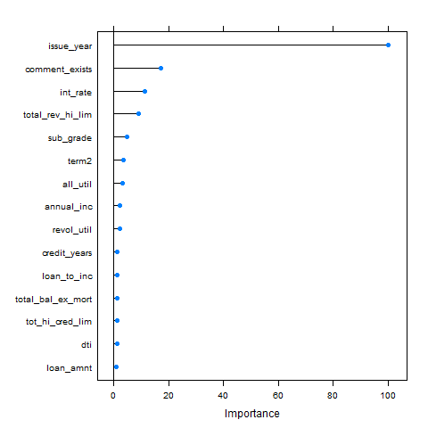

```{r setup, include=FALSE}
knitr::opts_chunk$set(echo = FALSE, cache=TRUE, warning = FALSE, 
                      message = FALSE, tidy=TRUE, fig.align = 'center', 
                      fig.width = 10, fig.keep='all')
```

```{r,results='hide'}
#load these packages
pacman::p_load(ggplot2, RColorBrewer, scales, dplyr, Hmisc, GGally,plotly,
               ggthemes)

#check that all packages loaded sucessfully
pacman::p_loaded(ggplot2, RColorBrewer, scales, dplyr, Hmisc, GGally, plotly,
                 ggthemes)

#Read the data
lc_loans<-read.csv("lc_loans.csv")

lc_loans_nlp <- lc_loans %>% filter(issue_year<2015)
```


##Lesson 1: I have a degree in NLP and "its #takingmeplaces"
One of the interesting things about the Lending Club dataset is that you get to read the borrower's story when they file out a request for a loan. For instance, here are some entries:

    - I need to upgrade my business technologies.
    - I got crazy with my credit cards in college and now its time to finally pay it all down.
    - I have an associates in business and its #takingmeplaces.
 
For an investor, it would be very time-consuming to read each application description, since there are hundreds of listings that get posted every day. At the same time, it might be dangerous to just ignore the application description altogether, since it could provide some valuable insights that would help differentiate bad borrowers from good borrowers. In my exploration of the data, I found an interaction between Lending Club risk score and whether a person has left a description or not. You can notice below that borrowers with a higher Lending Club risk score who also have left a comment on their loans tend to provide worse annualized returns relative to borrowers with similar risk score but who have not left a description. 


```{r, fig.width = 10}
#subset before 2015, since there are no comments for 2015,2016
before2015<-lc_loans_nlp  %>% filter(duration>12) %>%
    group_by(grade, comment_exists) %>% 
    summarise(median_ann_r=median(ann_r)*100) %>%
    mutate(comment_exists=as.factor(comment_exists))

ggplot(data = before2015, aes(x=grade, y=median_ann_r, color=comment_exists))+
    geom_point(size=4)+
    theme_solarized()+
    scale_color_manual(values=c("#999999", "#E69F00"), 
                       name="Has Description",
                       breaks=c("1", "0"),
                       labels=c("Yes", "No"))+
    theme(legend.position="bottom") +
    labs(title = toupper("median annualized return for each risk grade, by presence of description"),
       subtitle = "Note: loans that have at least one year of payments are depicted, since a geometric average for loans <1 year would exagerate returns\nthrough return compounding",
       x = toupper("Lending Club Risk Score"), y = toupper("Annualized Return (%)")) 
```


##Lesson 2: Defaults aren't everything--it's the bottom line return that counts
For an investor that purchases notes through Lending Club, defaults and charge-offs are very important, since they can lead to a large loss on their bottom line. Nonetheless, an often ignored aspect of default behavior is that not all bad borrowers behave the same way. To give you an idea of what I mean, here are 3 examples of "bad" borrowers:

 - Borrower 1: Dissapears from the face of the Earth after getting the loan. Defaults on the first payment. Loss of principal: 100%; Loss of interest: 100%
 - Borrower 2: Makes a couple of payments, but then defaults. After a few months some of the principal was recovered. Loss of principal: 20%; Loss of interest: 80%.
 - Borrower 3: Defaults on one of the last few payments on the loan. Loss of principal: 4%; Loss of interest: 2%.
    
In the scenario above, lending to Borrower 1, will lead to a -100% return. In the case of Borrower 2, we might be close to breaking even. For Borrower 3, we are actually making money, even though the borrower defaults. What this esentially means is that default behavior should be generally considered a continous variable rather than a rough discrete measure. 

In the figure below, I plotted the annualized and cumulative returns for 5000 out of 65000 loans that have the status of charged off or defaulted. You can note that there is a very clear non-linear relationship between the return which the loan gives and its loan status. Most of the bad loans don't end up in 100% loss of principal, and there are a few loans (4.2%) that have positive returns, despite their 'bad loan' status.

```{r, fig.width = 9.5}
#create var for loans with  positive return, otherwise 0
lc_loans$pos<-ifelse(lc_loans$cum_r>0,1,0)

bad_loans<-lc_loans %>% filter(loan_status!="Fully Paid") %>%
    rename(`Cumulative Return`=cum_r,
           `Annualized Return`=ann_r)

# bad_loans %>% 
#     group_by(pos) %>%
#     summarise(n=n())
#4.2% of bad loans have positive returns

#select 5000 rows at random to render plots faster
bad_loans2<-bad_loans[sample(nrow(bad_loans), 5000), ]


ggplotly(ggplot(data = bad_loans2, aes(x=`Cumulative Return`,
                                       y=`Annualized Return`,
                                       color=loan_status))+
    geom_point(size=2, alpha=.5)+
    theme_solarized() +
    scale_color_manual(values=c("#999999", "#E69F00"), 
                       name="Bad Loan Status:") +
    labs(title = toupper("Cumulative and annualized returns for each 'Bad Loan'"),
       x = toupper("Cumulative Return"), y = toupper("Annualized Return"))) 
```

This observation has important implications, because when one tries to build a credit model, the loan status label might not be the best outcome variable to use. Instead, a more appropriate outcome variable would be cummulative or annualized return of a loan or a variable that categorizes a loan as having a positive or negative return. 

#Lesson 3: Pre-liminary ML for predicting returns
This lesson is a follow-up on lesson 2. The goal will be to build a prediction algorithm that identifies which loans are likely to have positive cumulative returns. In other words, I don't predict the default classification outcome that is provided by Lending Club. Instead, I first calculate the cumulative returns based on all the payments and initial investment made by the lender. Then I create an outcome variable where loans are categorized as having either positive or negative returns. I used five different prediction algorithms and also a linear ensemble of those 5 algorithms (though it didn't lead to any improvements in returns). All predictors in the model have been carefully screened for leakage. 

You can see that all of the prediction algorithms that were implemented provide at least a 4.5% improvement in mean returns and at least a 3% improvement in median returns relative to the baseline. The basiline here is defined as the universe of all loans. Note that the reason why baseline cumulative returns are so low is because we are only dealing with loans that have a completed status (either fully paid, charged-off, or defaulted). Since the majority of the loans were issued in the last 1.5 years and the default hazard rates are higher in the first few months after origination, we have a very large chunk of charged-off loans that pulls our returns down. You can see the detail of the model building process in the file ml_ensemble.R

```{r, fig.width = 10}
results4<-read.csv("results4.csv")
cbPalette <- c("#999999", "#E69F00", "#56B4E9", "#009E73", "#F0E442", "#0072B2", "#D55E00", "#CC79A7")
ggplot(results4, aes(return_type, return)) +   
    geom_bar(aes(fill = model), position = "dodge", stat="identity")+
    theme_solarized() +
    scale_fill_manual(values=cbPalette, 
                       name="Model Tpe",
                       breaks=c("baseline", "C5.0","ensample_pred",
                                "gbm","rf","rpart_pred","xgbTree"),
                       labels=c("Baseline", "C5.0", "Ensemble",
                                "Gbm","Random Forest","Rpart",
                                "Xgboost"))+
    labs(title = toupper("Cumulative return earned for test data"),
       x = toupper("Return Type"), y = toupper("Cumulative Return")) 
```

You can see below the VARImp for the top 15 predictors in XGBoost and how the feature that identifies if a comment is present comes among the top 3 predictors:



The models created in this section are just a starting point. Future improvements could use:

- More training data
- Paramater tuning
- Model stacking
- Cumulative return as a continous variable rather than using a binary variable. 


